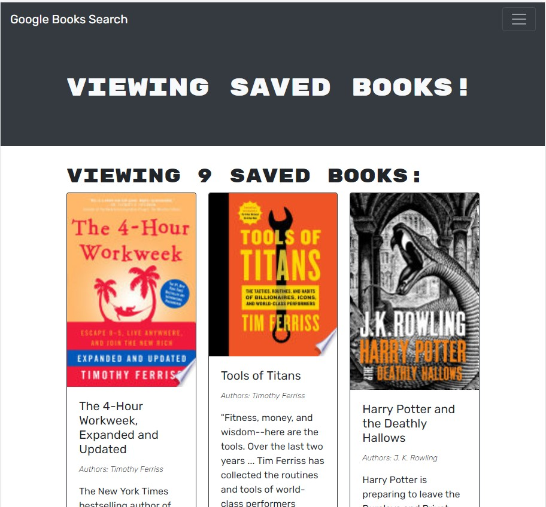

## Book Searcher

## Overview
An Application to search and save books using google book search as well as graph QL and React

## Features
When the application loads a user can search for booksbut cannot save them until they login or signup.  This Apllication uses JSON Web Tokens to save their login data and allow them to save books to their saved books list.

## Built With
* React JS
* GraphQL
* JavaScript
* Apollo
* Heroku
* Node JS 
* Concurrently
* MongoDB
* Mongoose
* Express

## Usage
Navigat to root directory and use NPM start command.

## Deployed Application
https://pure-wave-30954.herokuapp.com/

## Project Status
This Google Book Search is complete in adherence with acceptance criteria

## Contribution
Sole contributor - Neil Dino